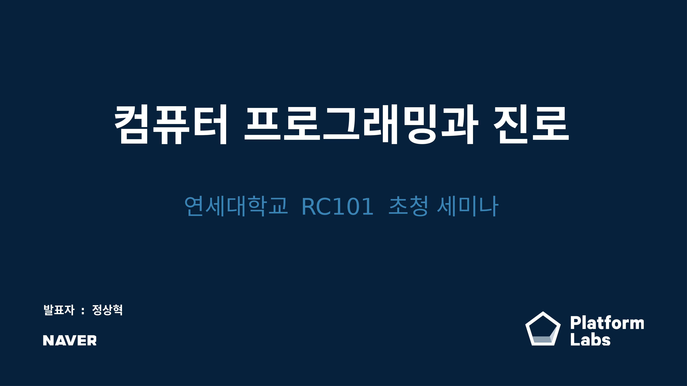

---

## 발표자 소개

* 2008 - 현재 : 네이버
   - 주로 백엔드 서버 개발 담당
   - 여러 네이버 서비스(주소록, 미투데이, 네이버TV 등)의 프로젝트 참여
   - 현재 네이버페이 기술 구조 개선 프로젝트 진행 중
* 2004 - 2008 : 삼성SDS
   - 공공사업 S/W 엔지니어
   - 교육부, 행자부, 감사원 프로젝트 참여
* 1997 - 2004 : 연세대학교 상경계열 재학
   - 경영학, 응용통계학 이중 전공

---

## 발표 주제
* 프로그래밍과 관련된 진로를 택한 과정
* 그 과정에서 어떤 대학 수업이 기억에 남았는지
* 신입생에게 추천하는 진로 탐색 & 학습 전략

---

## 우려 + 보완
* 전공을 모범적으로 살린 사례는 아님
    * 다른 선배들의 이야기도 많이 듣고, 다양한 사례 중의 하나로 균형감있게 감안하길
* 25년의 세월 흐름
	* 그 사이의 변한 것과 앞으로도 변하지 않은 것을 찾는 것은 여러분의 숙제

---

## 목차
* 진로 선택 경험
* 기억에 남는 수업
* 프로그래밍 공부 추천 자료 & 전략

---

# 진로 선택 경험

---

## 상경 계열 선택

* 공대 지망생
    * 중고등학교 때 프로그래밍이 꾸준한 취미
* 집안 사정으로 문과로 오게 되었음.
* 문과에서는 딱히 관심가는 전공이 없었음.
* 가장 무난해 보이는 '경영학과'가 있는 '상경계열' 선택

---

## 응용 통계학과 선택
* 당시 상경계열에는 경영/경제/응용통계학 3개의 전공 중 선택 가능
    * 이중 전공 권장 분위기
* 응통과가 적성에 맞을것 같아서 이중전공 선택
    * 수업 때 컴퓨터를 많이 쓸 것 같았음.
    * 1학년 때 통계학 기초 수업이 그나마 학점이 좋았음.

---

## 개발자 진로 선택

* 학교에서 들었던 컴퓨터 관련 수업이 재미있었음.
* 선배들을 보면 직장 생활을 다들 힘들어하는데 재미있을만한 순간이 일부라도 있으면 좋지않을까?
* 학점이 안 좋아서(3.04) 선택지도 넓지 않았음.
* 삼성SDS 지원/합격후 다른곳에는 지원하지 않음.

---

### 진로에 확신을 더한 계기 : 책 '앞으로 50년'
* 4학년 '중급경영통계학' 수업 때 교수님이 권장해주신 책
* 2002년 출판되었으니 20년 지났음.

---

> 컴퓨터 과학의 다음 50년에도 잠재력의 과장과 비용의 과소 평가라는 이 두 경향은 계속될 가능성이 높다. 이것은 인류가 주로 매우 덩치 큰 소프트웨어 체계를 유지하는 일에 종사하게 된다는, 즉 지구가 ‘서비스 센터 행성’ 이라고 불리게 될 것이라는 시나리오이다. 전혀 매력이 없는 미래상은 아니다 그것은 사람들의 고용을 계속 보장해 줄 것이기 때문이다. 

( 제이런 래니어(Jaron Lanier) 가 쓴 ‘복잡성의 절정(The Complexity Ceiling)’ 챕터 중 )

* [세상을 구원할 코볼(COBOL) 프로그래머 구합니다!](https://techit.kr/view/?no=20200407002655) 기사를 보면 이 미래상은 아주 허황된 것만은 아닌듯..

---

# 기억에 남는 수업

---

## 1학년
* [경영] 조직행동론
	* 경영학과의 문과적 성향 과목하고는 적성이 안 맞다는 결론을 내리게됨.
    * 관리자 역할을 하다가 돌아보니 정말 중요한 과목이였음.
* [응통] 통계학(1)
	* 주로 고등학교때 배웠던 내용
	* 다른 과목에 비해 상대적으로 학점이 잘나와서 전공 선택에 영향을 미침

---

## 2학년
* [응통] 컴퓨터 자료처리 : S-Plus(R의 친척)을 처음 배움

## 3학년
* [경영] 데이터베이스관리론: SQL 처음 배움
* [경영] 시스템 설계와 분석 : UML, Java 언어 처음 배움

---

## 4학년
* [응통] 회귀분석 (이학배 교수님) : 최고의 교수님. 통계가 예술적인 분야라고 느꼈음.
* [공대교양] C 프로그래밍 : 고등학교 때 C 공부했으니 학점이 잘 나올것 같아서 신청
* [공대교양] C++ 프로그래밍 : C++도 한번 배워보려고
* [공대교양] Java 프로그래밍 : 3학년 때 Java 배운거 복습 겸 학점 따러 들어감
* [산업공학과] 고객관계경영및 실습: 다양한 분석 모델 배우고 SAS E-Miner로 데이터 분석했던 기억에 남음.
* 그외 [경영]생산관리나 [응통]집단선택의 계량분석 수업에서 과제할때 Quick Basic, Java Applet등을 활용했던 기억이 있음.

---

## 전공별로 배운 것을 1가지씩만 꼽는다면?

### 응용통계학과
* 통계적으로 상관관계가 있다고해도 인과 관계가 있다고 결론 지을 수는 없다.
    * 예) 아이스크림 판매량과 익사자와의 상관 관계
    * 예) 나쁜 이름을 가진 코드에 버그가 많다. 하지만 나쁜 이름이 버그를 만든다는 증거는 아니다. 근본 원인은 실력 없는 프로그래머일 수도 있다.
([프로그래머의 뇌](http://www.yes24.com/product/goods/105911017)라는 책에 나오는 내용)

---

### 경영학과
* 분권의 시대. 조직의 권한은 분산되고 있다.
    * 예: 토요타의 품질관리. 실무자가 생산 라인스톱 가능.
    * 현대 지식 근로자는 실무자라도 정해진 일을 시키는대로만 한다고 볼 수 없음.

---

# 프로그래밍 공부 추천 자료 & 전략

---

## 프로그래밍의 특징
* 문/이과가 융합된 분야
    * 문제를 해결할 때의 성취감은 수학 문제 풀 때와 비슷
    * 근본적으로는 글쓰기
        * 코드를 쓰고 읽을 때 활성화되는 두뇌 영역은 언어와 관련된 영역이라고함
        * 사람과 기계를 동시에 이해시켜야 할
* 끊임없이 변화
    * 그러나 근본적으로 잘 변하지 않는 지식도 많음
    * 같은 일/지식만 활용한다고 지루해질 가능성이 낮음

----

## 프로그래밍 공부를 추천하는 이유

* 모든 분야에서 실용적인 도구
    * 데이터 정제 & 분석
    * 업무 자동화 (예: 엑셀 매크로)
* 직장에서 개발자와 협업할 일이 생길 수 있음
* 가성비 높은 취미 생활
    * 무엇인가를 만드는 재미가 있음.
    * 돈도 별로 안 들어감. 전시할 공간도 필요 없음
* 하다가 적성에 맞다면 본격 개발자 진로를 선택할 수도

---

## 공부 전략
* 학교 수업을 이용한 점진적 학습
    * 전공, 타과, 교양을 조합
* 관심 있는 친구들 모아서 수업 듣기
* 많은 분야 중 초보 수준을 벗어날 분야 하나를 고르기
    * 예: Python을 이용한 데이터 분석
* 독학 : 독서, Youtube, 온라인 강의
    * 쉬운 내용부터 시작해서 성취감 느끼기

---

## 추천 도서
- [모두의 엔트리 with 엔트리파이선 ](http://www.yes24.com/product/goods/56849149) : 블록 코딩에서 문자 코딩으로

---

- [모두의 파이썬 2](http://image.yes24.com/goods/66531799/XL) : 쉬운 파이썬 입문서

---

- [CODE](http://www.yes24.com/Product/Goods/16667186) : 컴퓨터 H/W, S/W의 원리를 단계적으로 설명

---

- [미래를 바꾼 아홉 가지 알고리즘](http://www.yes24.com/Product/Goods/8921236) :  이야기로 풀어낸 알고리즘

---

- [누구나 자료 구조와 알고리즘](http://www.yes24.com/Product/Goods/105122143)
: 친절한 설명의 알고리즘 입문서

---

- [Hello Coding 그림으로 개념을 이해하는 알고리즘](http://www.yes24.com/Product/Goods/37885448) : 그림과 함께 설명한 알고리즘 입문서

---

# Q & A
* 사전 질문 : https://github.com/benelog/yonsei-stats-rc101/issues/1
* 추가 질문
    * 음성 & 채팅창
* 세미나 후의 질문
    * https://github.com/benelog/yonsei-stats-rc101/issues 에 등록
    * sanghyuk.jung@navercorp.com 로 이메일
